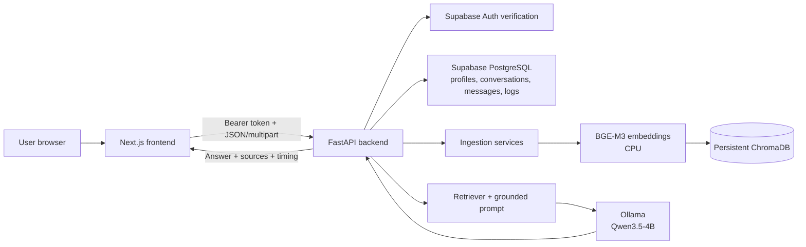
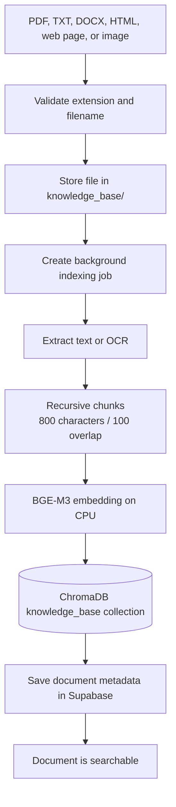
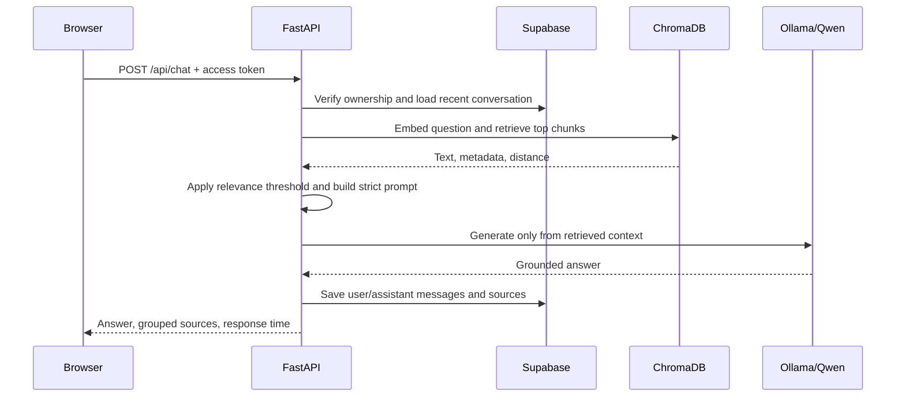
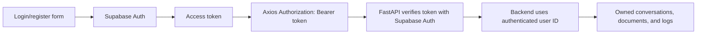
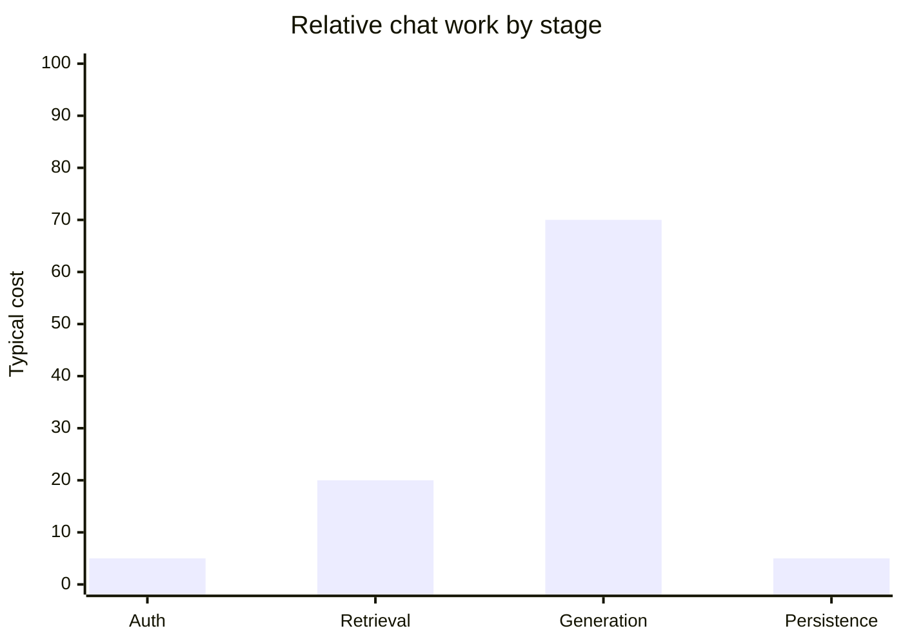

# AI Knowledge Chatbot

AI Knowledge Chatbot is a production-oriented, local-first knowledge assistant.
Users upload documents, the backend indexes them into a persistent vector
store, and authenticated questions are answered from retrieved document
context. The browser communicates only with FastAPI; it never calls Ollama,
ChromaDB, or Supabase with a server secret.

The project is developed on macOS and intended to run on Windows without
OS-specific paths or GPU-only requirements. The target machine is an Intel
i5-13600KF, GTX 1650 4 GB, and 16 GB RAM. CPU execution is supported
throughout the local AI pipeline.

## What is implemented

- Supabase Auth registration, login, bearer-token verification, and logout.
- Responsive Next.js chat interface with light/dark themes.
- Persistent conversation history stored in Supabase PostgreSQL.
- PDF, TXT, DOCX, HTML, web-page, PNG, JPG, and JPEG ingestion.
- OCR through Pillow and Tesseract for supported images.
- Background document indexing so uploads return before embedding finishes.
- BGE-M3 embeddings running locally on CPU.
- Persistent ChromaDB vector storage and similarity retrieval.
- Qwen3.5-4B generation through local Ollama.
- Grounded answers with a safe fallback when relevant context is unavailable.
- Grouped source references with pages, similarity percentage, and highlighted
  retrieved context.
- Dynamic response budgets: short questions use less generation, while
  summaries and explicit word-count requests receive more capacity.

## System architecture



Each component has one primary responsibility:

| Component | Responsibility | Why it is used |
| --- | --- | --- |
| Next.js App Router | Browser application and routes | Server/client React structure, production build, and responsive UI |
| TypeScript | Frontend type safety | Keeps API payloads and UI state consistent |
| Tailwind CSS | Styling | Fast responsive styling without a separate CSS framework |
| Axios | Browser HTTP client | Central base URL, bearer-token injection, refresh, and error handling |
| Supabase JS | Browser authentication session | Secure public Auth client with token refresh |
| FastAPI | API and orchestration layer | Typed Python endpoints, OpenAPI, async request handling, and middleware |
| Pydantic Settings | Backend configuration | Typed environment values with no secrets in source code |
| Supabase Auth | Identity and sessions | Registration, login, token verification, and user ownership |
| Supabase PostgreSQL | Application records | Profiles, conversations, messages, document metadata, and logs |
| LlamaIndex | Local RAG integration layer | Consistent LLM and embedding adapters without OpenAI dependency |
| Ollama + Qwen3.5-4B | Local answer generation | Private inference without a hosted model API |
| BAAI/bge-m3 | Local embeddings | Multilingual semantic retrieval and document search |
| ChromaDB | Vector persistence | Lightweight local similarity search with durable storage |
| pypdf/python-docx/BeautifulSoup | Text extraction | Format-specific document loading |
| Pillow + Tesseract | Image OCR | Extracts text from image-only documents |

## Document ingestion flow



The upload endpoint returns `202 Accepted` and a job ID. The frontend polls the
job status while the CPU-heavy extraction and embedding work continues. Adding
a document adds vectors; it does not retrain Qwen or BGE-M3.

Supported extensions are `.pdf`, `.txt`, `.docx`, `.html`, `.htm`, `.png`,
`.jpg`, and `.jpeg`. Image OCR also requires a Tesseract executable installed
on the host machine.

## Question and answer flow



The prompt instructs the model to answer only from retrieved context. If no
chunk passes the relevance threshold, Qwen is not called and the API returns:

```text
I could not find this information in the knowledge base.
```

Source records are grouped by filename. A source can contain multiple pages,
the strongest similarity percentage, and the combined retrieved excerpts. The
frontend displays that excerpt in a yellow context preview when clicked.

## Authentication and data ownership



The Supabase service key is server-only. It must never appear in
`frontend/.env`, browser code, or a client request. Row-level security policies
and backend ownership checks prevent users from reading another user's
conversations or documents.

## Repository layout

```text
AI-Knowledge-Chatbot/
├── frontend/
│   ├── src/app/                  # Next.js routes and global styles
│   ├── src/components/           # Auth, chat, upload, and UI components
│   ├── src/hooks/                # Auth/session hooks
│   ├── src/lib/                  # Browser Supabase client
│   ├── src/providers/            # Theme and React Query providers
│   ├── src/services/             # Axios, chat, and document APIs
│   ├── src/types/                # TypeScript domain/API types
│   └── src/utils/                # Error and source normalization helpers
├── backend/
│   ├── app/api/                  # FastAPI route modules
│   ├── app/core/                 # Settings and logging
│   ├── app/database/             # Supabase client and repositories
│   ├── app/middleware/           # Safe exception handling
│   ├── app/services/ai/          # LLM, embeddings, retrieval, prompts
│   ├── app/services/ingestion/   # Loaders, OCR, chunks, indexing jobs
│   ├── app/services/vector/      # ChromaDB client
│   └── tests/                    # Backend unit/integration boundary tests
├── docs/                         # Supporting design and database notes
├── knowledge_base/               # Uploaded source files; ignored by Git
├── scripts/                      # Cross-platform project scripts
├── supabase/migrations/          # PostgreSQL schema and RLS policies
├── .env.example                  # Shared environment template
└── LICENSE
```

Runtime-generated directories are ignored by Git:

- `backend/chroma_db/` stores persistent vectors.
- `backend/logs/` stores application logs.
- `knowledge_base/` stores uploaded documents.

## Setup guide

### 1. Clone and create environments

Install Git, Node.js 20.9 or newer, Python 3.11 or newer, Conda, and Ollama.
The existing Conda environment used by this project is `cenv`.

```text
conda activate cenv
python --version
```

The command must report Python 3.11 or newer. All backend packages should be
installed into `cenv`, not into the system Python installation.

### 2. Configure Supabase

1. Create a Supabase project.
2. Open the Supabase SQL Editor.
3. Run [`supabase/migrations/001_initial_schema.sql`](supabase/migrations/001_initial_schema.sql).
4. Confirm these tables exist: `profiles`, `conversations`, `messages`,
   `documents`, and `logs`.
5. Copy `backend/.env.example` to `backend/.env`.
6. Set `SUPABASE_URL`, `SUPABASE_ANON_KEY`, and `SUPABASE_SERVICE_KEY` in
   `backend/.env`.

If PostgREST reports `PGRST205` after applying the migration, run this in the
Supabase SQL Editor and restart the backend:

```sql
notify pgrst, 'reload schema';
```

### 3. Configure Ollama

Install Ollama for the host operating system, then download the configured
model:

```text
ollama pull qwen3.5:4b
ollama serve
```

The default performance settings are suitable for short answers on the target
hardware:

```env
OLLAMA_BASE_URL=http://localhost:11434
OLLAMA_MODEL=qwen3.5:4b
OLLAMA_NUM_PREDICT=128
OLLAMA_CONTEXT_WINDOW=3072
OLLAMA_THINKING=False
OLLAMA_KEEP_ALIVE=10m
```

Response length is selected per question. Do not increase `OLLAMA_NUM_PREDICT`
unless longer answers are required; higher limits increase CPU generation time.

### 4. Install and run the backend

From the repository root:

```text
conda activate cenv
cd backend
python -m pip install -r requirements.txt
python -m uvicorn app.main:app --reload --host 127.0.0.1 --port 8000
```

The backend is available at `http://127.0.0.1:8000`.

Useful public endpoints:

| Endpoint | Purpose |
| --- | --- |
| `GET /health` | Basic backend health |
| `GET /docs` | Swagger UI |
| `GET /redoc` | ReDoc API documentation |
| `GET /api/chat/health` | Local LLM, embedding, and Chroma readiness |

Protected endpoints require `Authorization: Bearer <access_token>`:

| Endpoint | Purpose |
| --- | --- |
| `POST /api/auth/register` | Register a user |
| `POST /api/auth/login` | Log in and receive a token |
| `GET /api/auth/me` | Read the current user |
| `POST /api/chat` | Ask a grounded question |
| `GET /api/chat/conversations` | List recent conversations |
| `GET /api/chat/conversations/{id}` | Load one conversation |
| `POST /api/documents/index` | Upload and index a document |
| `GET /api/documents/index/{job_id}` | Poll indexing status |

### 5. Configure and run the frontend

Copy `frontend/.env.example` to `frontend/.env`:

```env
NEXT_PUBLIC_API_URL=http://localhost:8000
NEXT_PUBLIC_SUPABASE_URL=
NEXT_PUBLIC_SUPABASE_ANON_KEY=
```

Only public Supabase values belong in this file. Never add
`SUPABASE_SERVICE_KEY` to frontend configuration.

From the repository root:

```text
cd frontend
npm install
npm run dev
```

Open `http://localhost:3000`. Use `/register` or `/login`, then open the
protected `/chat` workspace. Documents can be uploaded from the sidebar or
dropped directly into the chat area.

### 6. Optional OCR setup

Install the Tesseract OCR executable separately for the operating system. The
Python package `pytesseract` is installed by `backend/requirements.txt`, but it
does not include the Tesseract executable itself. Text documents, PDFs, DOCX,
and HTML do not require OCR.

## Development commands

Frontend commands, run from `frontend/`:

```text
npm run dev
npm run lint
npm run typecheck
npm run build
npm start
```

Backend commands, run from `backend/` with `cenv` active:

```text
python -m uvicorn app.main:app --reload
pytest
```

The backend tests use fakes for Supabase and local model boundaries. They do
not require real credentials or a running Ollama server.

## Performance model



Generation is normally the largest cost on CPU-constrained machines. The
application reduces unnecessary work by caching local models, warming BGE-M3
at backend startup, limiting conversation history, disabling model thinking
when supported, and selecting output budgets from the question. Exact timing
depends on the Ollama build, model state, document size, and whether the model
is already loaded in memory.

## Troubleshooting

**Chat returns `401 Unauthorized`**

Sign in again and confirm the frontend points to the same backend URL. The
Axios client refreshes Supabase sessions and retries one expired-token request.

**Chat returns `503 Service Unavailable`**

Check the backend log, then verify:

```text
ollama serve
ollama list
GET http://127.0.0.1:8000/api/chat/health
```

Also confirm the Supabase migration was applied and the three backend Supabase
keys are set.

**Document upload remains processing**

Check `backend/logs/app.log`. Image indexing requires the Tesseract executable;
other formats require the matching Python loader dependency.

**Answers are too slow**

Keep `OLLAMA_NUM_PREDICT` at `128` for fact questions, keep thinking disabled,
and make sure the backend has completed BGE-M3 warmup before sending a chat
request. The backend logs separate retrieval time from Ollama generation time.

## Security boundaries

- No OpenAI package or `OPENAI_API_KEY` is required.
- Ollama, embeddings, retrieval, and document processing run locally.
- Supabase service credentials remain in backend-only environment files.
- User-owned data is checked before conversation, document, and message access.
- Secrets and uploaded/runtime data are excluded by `.gitignore`.

## License

MIT. See [LICENSE](LICENSE).
